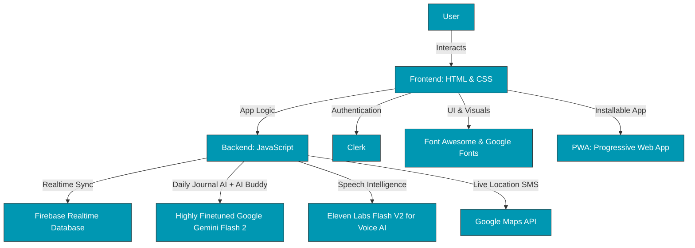

# **Relax.me**

**Your personal AI-powered mental health companion**

**Relax.me** is a beautifully crafted emotional wellness platform that combines breathing tools, journaling, ambient space, conversational AI, and emergency support — all designed with empathy, user experience, and accessibility in mind.

---

## 🚀 **Demo**

[Live Demo >](https://relax-me-web.web.app/)

> **Note:** API keys, image/audio assets and database credentials have been omitted from the codebase because of file size limitations and security reasons.

---

## 🎯 **Problem Statement**

Mental health issues are more common than we often acknowledge. Anxiety, burnout, overthinking, and emotional overwhelm affect people across all age groups — not always in extreme ways, but often subtly, consistently, and cumulatively. Left unaddressed, even minor emotional strain can compound into something much more difficult to manage.

The core problem is that emotional regulation isn't intuitive for most people — and we’re rarely taught how to manage our thoughts, track our emotions, or calm ourselves down during moments of distress. When someone feels anxious or scattered, they usually don’t have structured tools nearby to help them slow down, reflect, or feel supported.

This gap creates a silent problem: people needing help, but not knowing where to turn — or not feeling like their needs are “big enough” to seek formal care.

**Relax.me** was built to fill that space. A place where users can process their thoughts, regulate their breathing, understand their emotional patterns, and reach out when needed — all without judgment, complexity, or noise. It’s about making emotional care **personalized, effective and accessible** for everyday life.

---

## 💡 **Solution**

Relax.me offers a complete emotional care system through:

✔ Breathing exercises with guided techniques and ambient audio  

✔ Balloon pop therapy for safe emotional release 

✔ Daily journaling with AI tagging, summarization, insights, and mood heatmap  

✔ Personalized AI Buddy with visual avatar and flexible persona  

✔ Ambient Mode with customizable scenes, sounds, and quotes  

✔ Panic support system with emergency SMS, location, and grounding tools

---

## ✨ **Key Features**

### 🧘‍♂️ Breathing Exercise  

- Choose from three calming techniques: Box (4-4-4-4), Calm (4-7-8), and Deep (5-2-5)  

- Includes soft visual animations that guide inhale, hold, and exhale  

- Accompanied by binaural meditation sounds for deeper mental relaxation  

- Ideal for quick focus resets, sleep preparation, or anxiety relief  

### 🎈 Balloon Pop Therapy  

- A gamified, interactive outlet for stress and emotional tension  

- Tap to pop balloons in a soothing, responsive UI  

- Multiple balloon types with different points; gold balloons provide bonuses  

- Level-based difficulty increase (faster balloon movement and more balloons)  

- Encourages healthy frustration release, improving mood and focus  

- Real-time tracking of score, level, and balloon count  

### 😊 AI Buddy  

- Create your own AI companion with a name and personality traits (e.g., empathetic, humorous, wise)  

- Select and update avatars to personalize your buddy visually  

- Engage in warm, supportive conversations — vent, reflect, or just chat  

- AI Buddy listens without judgment, replies with care, and encourages emotional openness  

- You can rename or reconfigure your buddy anytime to match evolving needs  

### 🗣️ Voice AI

- Have real-time voice conversations with your AI Buddy

- AI responds with natural, emotionally intelligent speech — making conversations feel warmer & personal

- Ideal when users prefer talking over typing, especially during emotional moments

- Voice pitch, tone, and pace change based on the emotion behind its own words

- Adds vocal nuance for more human-like, comforting interaction

### 📔 Daily Journal AI

- Write journal entries with automated emotions tagging (anxious, hopeful, grateful, etc) 

- AI automatically also detects sentiment (positive, negative, neutral)

- Provides personalized AI-generated insights based on entry tone and content

- Automatic AI-based summarization of longer entries for easier review  

- A built-in Mood Heatmap visualizes daily emotion patterns on a calendar grid

- Search/filter journals by emotion tags and date  

- Helps users track emotional cycles and discover hidden patterns over time  

### 🌄 Ambient Mode  

- Offers a distraction-free environment with peaceful backgrounds  

- Shuffle through motivational quotes for reflective thinking  

- Ambient sound options include:  
  - Piano music  
  - Nature sounds  
  - Rain sounds  
  - Fireplace sounds  
  - Lofi beats  
  - Binaural beats  
  - Cafe ambience  
  - Library ambience  

- Visual themes like rainy cafe, sunny field and more, enhance immersion  

- Works great during daily journaling, relaxation, breathing sessions, or unwinding moments  

### 🚨 Panic Support  

- Designed for moments of acute anxiety, panic attacks, or emotional overwhelm  

- Emergency Panic Button instantly sends an SMS with your live location to saved contacts 

- Add and save your therapist and emergency support contacts  

- Access calming tools immediately:  
  - Guided breathing  
  - 5-4-3-2-1 Grounding technique using senses  
  - Ambient Mode  

- Provides international mental health helpline options with one-tap access  

### 📱 Progressive Web App (PWA)

- Relax.me is a fully installable PWA

- Some features seamlessly work offline after first load

- Add to home screen on mobile or desktop for native app-like experience

- Fast load times, background sync, and app shell architecture

- Improves accessibility and availability, even with limited connectivity

---

## 🛠️ **Technology Stack**

- **Frontend:** HTML + CSS  

- **Backend:** JavaScript  

- **AI Models (Chat, Sentiment, Summary):** Highly Finetuned Google Gemini Flash 2  

- **Speech Intelligence:** Eleven Labs Flash V2 for real-time speech generation and vocal emotion modulation

- **Database:** Firebase Realtime Database  

- **Location Services:** Google Maps for real-time GPS data in panic mode  

- **Icons & Fonts:** Font Awesome and Google Fonts  

- **Authentication & User Management:** Clerk

- **PWA (Progressive Web App):** Powered by service workers and web manifest for native-like experience

---

## 📋 **Impact**

Relax.me is designed as a true emotional wellness companion. Its features are tailored to address both everyday struggles and critical moments.

- **Proactive Self-Care**: Helps users build healthy routines through journaling, breathing, and reflection  

- **Crisis Management**: Ensures users have access to safety tools, grounding methods, and emergency support  

- **Emotion Tracking**: Enables long-term emotional insight via heatmaps and AI summaries 

- **Healthy Expression**: Balloon pop and journaling offer non-destructive ways to release emotional tension  

- **Environmental Regulation**: Ambient Mode creates a peaceful digital atmosphere — combining visuals, sound, and quotes to help users reset, focus, or simply breathe.

- **Conversational Support**: The AI Buddy provides a space to talk, vent, or process emotions through natural conversation, offering presence and care even in solitude.

- **Always Available**: Whether it's 2am or midday, Relax.me is there — quietly supporting, never judging  

By focusing on calm aesthetics, deeply empathetic design, and smart technology, Relax.me makes emotional self-care accessible, engaging, and genuinely comforting.

---

## 🚀 Getting Started

### Requirements:
- A modern web browser  
- Internet connection  
- Location access for panic mode (optional)

### Steps:
1. Open the app in your browser  
2. Log in or Sign up on the account page
3. Start with your emotional wellness journey

---

## 🤝 Contributing

Contributions are welcome!

1. Fork the repository  
2. Create a new branch (`git checkout -b feature/your-feature`)  
3. Commit your changes (`git commit -m 'Add feature'`)  
4. Push to the branch (`git push origin feature/your-feature`)  
5. Open a pull request  

---

## 🛡️ License

This project is shared publicly for learning and inspiration purposes only.

❌ You may **NOT** copy, reuse, redistribute, or modify this code.  
✅ You may view and learn from the code.

Copyright © | All rights reserved

---

Built with ❤️ to make emotional care more accessible, gentle, and effective for everyone.
